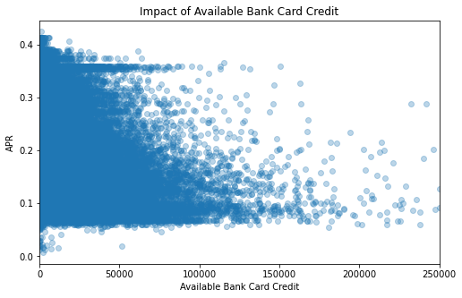
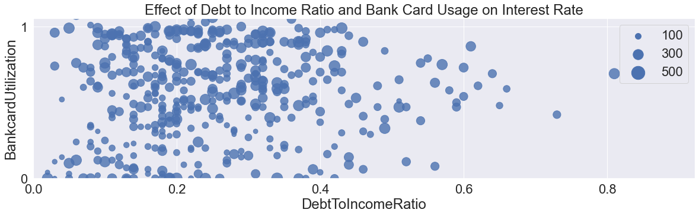
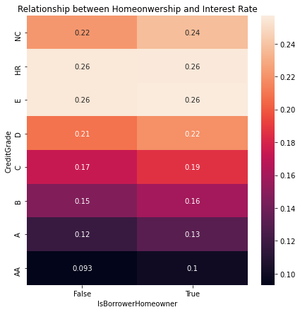

# What factors drive consumer interest rates?  
 
This project explores this question using the Prosper Loan dataset with Python and Seaborn visualiztions.  The Prosper loan dataset contains 113,937 loans with 81 variables on each loan, including loan amount, borrower rate, current loan status, borrower income, and others.

Inquiry: Investigated patterns in loans including amount, borrower rate, current loan status, borrower income, and others to help stakeholders/lenders understand the composition of their portfolio and identify risks and opportunities.

Tools & Methods: The data set was pretty clean overall.  I had to change data types to datetime or categorical as required, and transformed the IncomeRange, EmploymentStatus, and LoanStatus variables/colums to ordered categorical data types and the map function.  Matplotlib and Seaborn were used to visualize and explore different variables and correlations.

Analysis: 

One theme in particular which stood out was that the borrower rate decreased with the amount of credit available in both overall dollar and percentage terms as shown below:

  

Bank Card Utilization shows borrower % credit available
  

Another surprise finding was that owning a home did not result in better borrower rates and for some credit grades the borrower rate was even higher ( D borrower and below)
  

Recommendation: 
